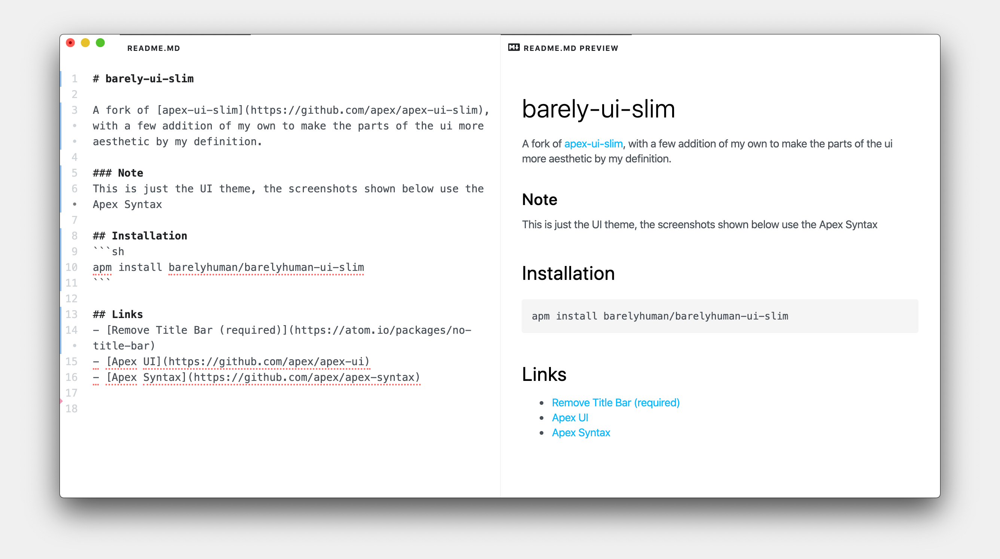

# barely-ui-slim

A fork of [apex-ui-slim](https://github.com/apex/apex-ui-slim), with a few addition of my own to make the parts of the ui more aesthetic by my definition.

### Notes
- This is just the UI theme, the screenshots shown below use the Apex Syntax

- The theme has only been tested with Mac OS X and I'd need contributors to fix it for other os's


## Installation
```sh
apm install barelyhuman/barelyhuman-ui-slim
```

## Screenshot




## Links
- [Remove Title Bar (required)](https://atom.io/packages/no-title-bar)
- [Apex UI](https://github.com/apex/apex-ui)
- [Apex Syntax](https://github.com/apex/apex-syntax)
